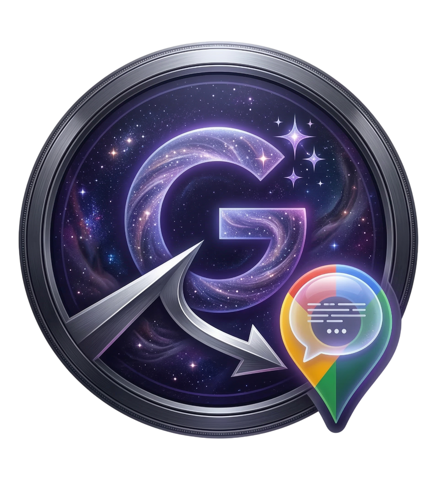

  

# 📍 Gemini Pin Navigator

A powerful Tampermonkey userscript that adds a much-needed pinning system to Google Gemini. Never lose track of important messages in long conversations again!

## ✨ Features
* **Pin Current Viewport:** Bookmark exactly what you are looking at.
* **Spatial Sorting:** Pins are automatically sorted by their physical order in the chat.
* **Deep Sync & Rescue:** A robust sync button that climbs the chat history to recover and re-link older pins after a page refresh. [Beta, but works]
* **Home Button:** Instantly jump to the bottom of the conversation.
* **Bypasses Trusted Types:** Securely built to bypass Gemini's strict DOM injection rules.

## 🚀 How to Install
1. Install the [Tampermonkey](https://www.tampermonkey.net/) extension for your browser.
2. **[CLICK HERE TO INSTALL THE SCRIPT](https://github.com/IlkerGuness/gemini-pin-navigator/raw/refs/heads/main/gemini-pin-navigator.user.js)**
3. Open or refresh Google Gemini, and enjoy the new pin sidebar!
